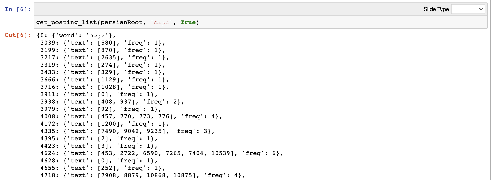
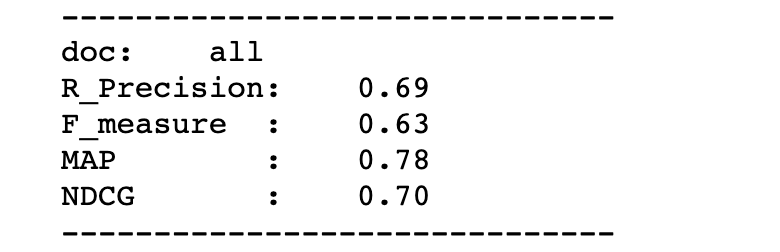

# Modern Information Retrieval
The course covered broad topics in information retrieval from traditional ways of scoring relevance between a query and documents to the state-of-the-art
machine learning algorithms for scoring documents. The project was spilled into three different phases as follows:

## 1. Processing Persian Wikipedia Documents
Firstly, I designed a tree-based data structure (trie) to index words at each document and saved its number of occurrence and its position in the text. By sending
a request to this index, we can get a posting list of each word.

Then, I implemented spell correction with edit distance on the query and calculated scores of documents based on term frequency (tf) and inverse document frequency (idf) in the documents' vector space. The output of the algorithm was evaluated with MAP, F-Measure, R-Precision, and NDCG.

## 2. Clustering and Classification
In this phase, each document has been classified based on its content into four categories: world, sports, business, and science/tech. We used simple classifiers like Naive Bayes and K nearest neighbors (with cosine-similarity and Euclidean distance) to train on the training set and validate its performance on the test set.
